# End-to-End Subscriber Rescue Journey

## 1. Lifecycle State Machine

```mermaid
stateDiagram-v2
    [*] --> Active_Healthy : Subscription Created (Card valid > 60d)
    
    Active_Healthy --> Expiring_Soon : Card expiry within 60 days (MEDIUM)
    Expiring_Soon --> Critical_Risk : Card expires before next billing cycle (CRITICAL)
    
    Active_Healthy --> Soft_Decline : Temporary bank decline (insufficient_funds) (HIGH)
    Soft_Decline --> Critical_Risk : 2nd consecutive failure (CRITICAL)
    
    Critical_Risk --> Auto_Rescue_Dispatched : invoice.payment_failed (AutoRescue active)
    
    Auto_Rescue_Dispatched --> Subscriber_Portal : Subscriber clicks 1-click rescue link
    Subscriber_Portal --> Payment_Method_Updated : Subscriber inputs new payment card
    
    Payment_Method_Updated --> Resolved : payment_method.updated webhook fires
    Resolved --> Active_Healthy : Failures reset to 0; RiskTier set to LOW
```

---

## 2. Journey Stages

### Stage 1: Pre-Billing Risk Detection
- Subscriber has an active subscription.
- Reetayn calculates that their card will expire prior to the upcoming `current_period_end`.
- The subscriber's risk tier is deterministically elevated to `CRITICAL`.
- Operators viewing this customer in the native Stripe Dashboard immediately see the red **"Payment At Immediate Risk"** badge.

### Stage 2: Payment Failure & Auto-Rescue Trigger
- The renewal cycle arrives and the card charge is declined.
- Stripe emits `invoice.payment_failed`.
- Reetayn ingests the event in under 50ms:
  - Increments `consecutiveFailures`.
  - Ingests `decline_code`.
  - Generates a single-use Customer Portal link configured for `payment_method_update`.
  - Creates a `RescueLog` entry marked `DISPATCHED`.

### Stage 3: Zero-Friction Subscriber Experience
- The subscriber receives the rescue notification with the direct 1-click update link.
- Clicking the link takes the subscriber directly to the Stripe-hosted payment method update form without requiring passwords, logins, or two-factor authentication hurdles.
- The subscriber inputs their new card in ~15 seconds.

### Stage 4: Resolution & Failure Reset
- Upon successful card entry, Stripe fires `payment_method.updated`.
- Reetayn catches the webhook:
  - Resets `consecutiveFailures` to `0`.
  - Recalculates `churnRiskTier` to `LOW`.
  - Updates the matching `RescueLog` status to `RESOLVED` with timestamp.
  - The subscriber is redirected to `https://reetayn.com/rescue/success`.
- The subscriber's service continues uninterrupted with zero involuntary churn.
