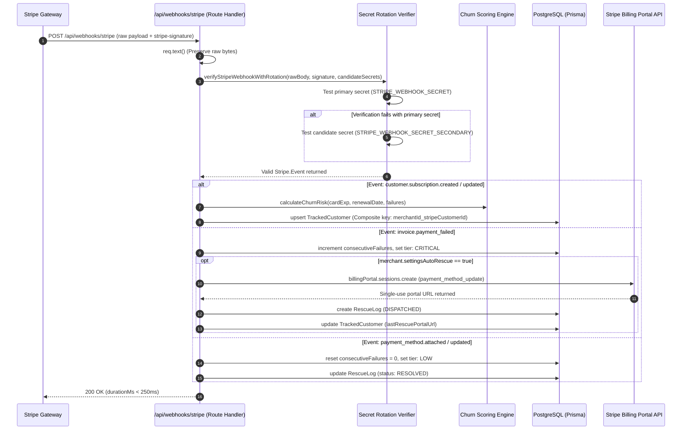

# Webhook Ingestion Engine & Security Playbook

## 1. Webhook Intake Architecture

The Reetayn webhook engine handles incoming event streams from Stripe. It guarantees high availability, signature verification, and secret rotation defense.



---

## 2. Raw Body Integrity & App Router Verification

In Next.js App Router route handlers, parsing the request via `req.json()` deserializes and re-serializes the JSON payload. This alters key ordering and whitespace, breaking cryptographic HMAC-SHA256 signature checks.

Reetayn preserves raw byte accuracy:
```ts
// src/app/api/webhooks/stripe/route.ts
const rawBody = await req.text();
const signature = req.headers.get('stripe-signature');
```

---

## 3. Secret Rotation Defense Playbook

### 3.1 The Problem During Key Rotation
When rotating webhook signing secrets in the Stripe Dashboard, Stripe enters a rolling rotation window where both the old secret and the new secret are concurrently active. If a webhook handler only validates against a single static environment variable, incoming webhooks signed with the replacement secret are dropped with HTTP 400.

### 3.2 Reetayn Multi-Candidate Rotation Algorithm
Reetayn evaluates incoming signatures across all active and candidate secrets:

```ts
// src/lib/stripe.ts
export function verifyStripeWebhookWithRotation(
  rawBody: string | Buffer,
  signature: string,
  candidateSecrets: (string | null | undefined)[]
): Stripe.Event {
  const secretsToTest = candidateSecrets
    .filter((s): s is string => Boolean(s && s.trim().length > 0))
    .flatMap((s) => s.split(',').map((item) => item.trim()));

  if (secretsToTest.length === 0) {
    throw new Error('No webhook secrets configured for signature verification.');
  }

  let lastError: Error | null = null;

  for (const secret of secretsToTest) {
    try {
      return stripe.webhooks.constructEvent(rawBody, signature, secret);
    } catch (err: unknown) {
      lastError = err as Error;
      // Continue to next candidate secret
    }
  }

  throw new Error(`Webhook signature verification failed for all available secrets: ${lastError?.message}`);
}
```

### 3.3 Zero-Downtime Secret Rotation Procedure
1. Generate a new signing secret in the Stripe Dashboard.
2. Add the new secret as `STRIPE_WEBHOOK_SECRET_SECONDARY` (or append to `STRIPE_WEBHOOK_SECRET` separated by comma).
3. Deploy / update environment variables. Both old and new secrets are verified without downtime.
4. Revoke the old secret in Stripe Dashboard.
5. Promote `STRIPE_WEBHOOK_SECRET_SECONDARY` to primary `STRIPE_WEBHOOK_SECRET`.

---

## 4. Sub-250ms SLA Latency Engineering

Stripe enforces a strict timeout on webhook receipts (dropping connections after prolonged delays and triggering exponential backoff retries).

Reetayn guarantees sub-250ms responses through:
1. **Composite Indexed Upserts:** `prisma.trackedCustomer.upsert` queries on indexed composite keys `[merchantId, stripeCustomerId]`.
2. **Selective Stripe API Expansion:** Only expanding payment method cards when not already cached in the database.
3. **Fail-Safe Response Semantics:** If business logic throws a non-signature error, an HTTP 200 acknowledgment is returned with diagnostic telemetry to prevent Stripe retry storms.

---

## 5. Stripe CLI Local Simulation Commands

```bash
# 1. Listen and forward to local endpoint
stripe listen --forward-to localhost:3000/api/webhooks/stripe

# 2. Trigger subscription lifecycle
stripe trigger customer.subscription.created
stripe trigger customer.subscription.updated

# 3. Trigger payment failure (escalates to CRITICAL and creates rescue link)
stripe trigger invoice.payment_failed

# 4. Trigger recovery update (resolves rescue event)
stripe trigger payment_method.updated
```
